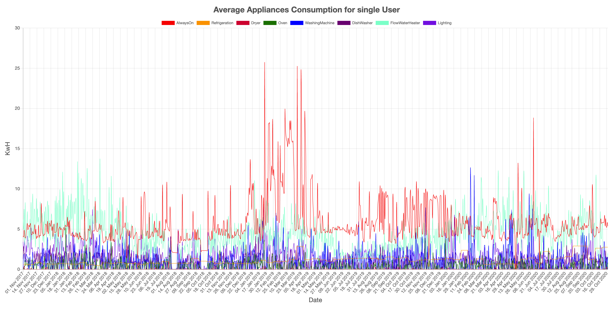
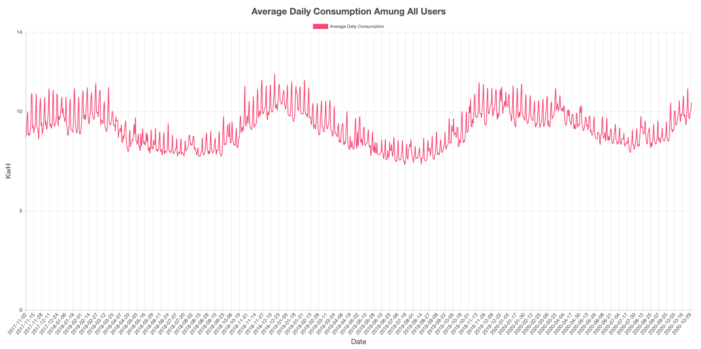
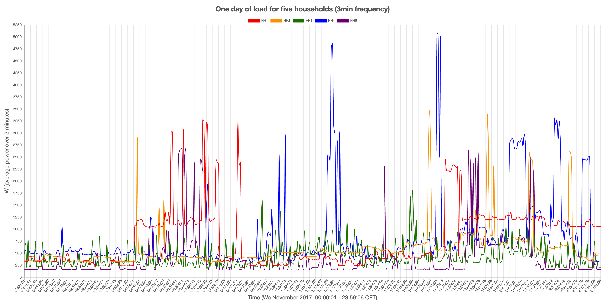
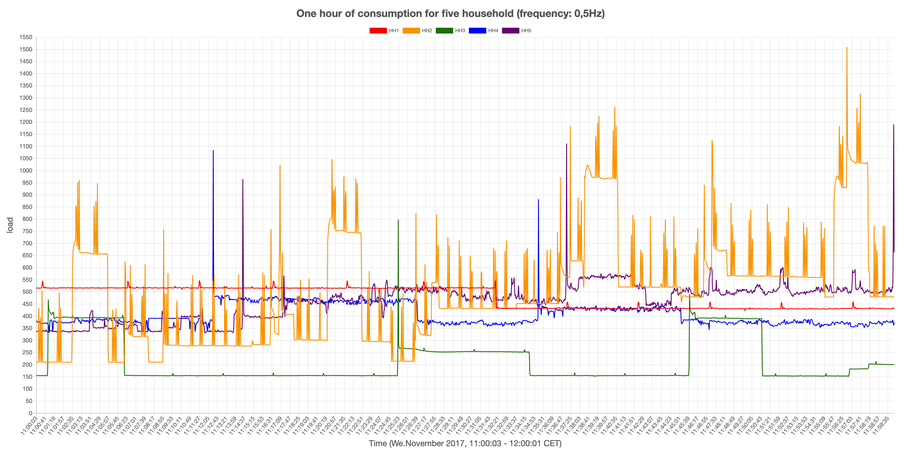
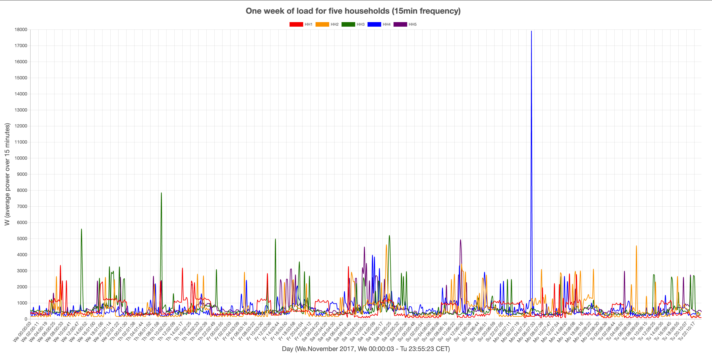

# GEM HOUSE  openData: Graphs
## Concept
The repo includes a node js based script that processes the provided `csv` files and generate web based charts to visualize some insights.

## Run The APP

#### Node is Needed

[Node.js](https://nodejs.org/en/)

#### Dependency manager
install  `yarn`  package manager globally  [Yarn](https://yarnpkg.com/lang/en/docs/install/)

#### Recommended IDE

[VSCode](https://code.visualstudio.com/)

### How to use
- clone the repo  `git clone https://github.com/runesam/gem-house-openData-graphs.git`.
- navigate to the project root dir  `cd gem-house-openData-graphs`.
- install dependencies via  `yarn`.
- copy the `csv files` to the corresponding folders in the `Data` folder.
- run the app via `node index.js`

### Data Folder
The `data` folder is where the `csv` files lives in nested folders for each data set.
When we execute the script, it will reach to each folder and scan the files inside. then map the data to another format to be used by the charts.

in this repo we have the following data folders:
* `daily_data_each_user_in_separate_csv` for user's daily consumption. a `csv` file per user.

    `csv` format sample:

    | date 		 | energy		| power  | power1| power2 | power3 |
    | :--------: | :----------: | :----: | :---: | :----: | :----: |
    | 2018-09-19 | 116379038911 | 331025 | 24488 | 215011 | 91526  |

* `disaggregation-data` for user's appliances disaggrigation. this folders meant to be for single user.

    `csv` format sample:

    | id 	 | applianceType | startTime  | stopTime.  | usage | unit |
    | :----: | :-----------: | :--------: | :--------: | :---: | :--: |
    | 524288 | AlwaysOn		 | 1591488000 | 1591574400 | 5.861 | kWh  |

    so a single `csv` file is expected to be there.

* `random_users` for users' raw consumption data.
 
    `csv` format sample:

    | date		 		 	  | timestamp     | energy         | power  | power1 | power2 | power3
    | :---------------------: | :-----------: | :------------: | :----: | :----: | :----: | :-----
    | 2017-11-01T00:00:01.604 | 1509494401604 | 17522361115000 | 477550 | 192650 | 35510  | 249390

### Charts Folder
The `charts` folder is where the web based charts lives. It include 5 folders each folder includes the needed assets for the chart to be generated.

in this repo we have the following charts folders:
* `average_appliances_consumption` to present disaggrigation data for one user that has several appliances.
  
    The data that this chart uses, are based on the data from the `disaggregation-data` folder.

    The appliances that can be disaggrigated are the following:
    `['AlwaysOn', 'DishWasher', 'Dryer', 'FlowWaterHeater', 'Lighting', 'Oven', 'Refrigeration', 'WashingMachine']`.

    

        
    

* `average_daily_consumption` to present a graph based on the daily data that contains all users average consumption.

    The data that this chart uses, are based on the data from the `daily_data_each_user_in_separate_csv` folder.

    

        
    

* `day_consumption` to present 1 day raw data samples for 5 households.

    The data that this chart uses, are based on the data from the `random_users` folder.

    

        
    

* `hour_consumption` to present 1 hour raw data samples for 5 households.

    The data that this chart uses, are based on the data from the `random_users` folder.

    

        
    

* `week_consumption` to present 1 week raw data samples for 5 households.

    The data that this chart uses, are based on the data from the `random_users` folder.

    

        
    

